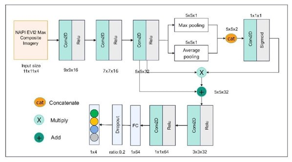

This repository contains the code used for the analyses presented in the paper.
>Tang, Yongli, and Chao Fan. "Evaluating building-level tree cover change in Southern California wildland-urban interface using high-resolution satellite imagery." Journal of Environmental Management 380 (2025): 125160. https://doi.org/10.1016/j.jenvman.2025.125160

# The code supports the following main steps
* 1m WUI Land Cover Mapping (2010/2022): Train a spatialattention-based CNNs model locally and infer on Google Earth Engine.

* Cluster buildings to form evaluation units to evaluate tree cover change, considering their shared fire risk and tree cover management responsibility
* Classify buildings based on spatial arrangement into four types: very dense, dense, scattered, and isolated.
* Export tree cover data for building clusters(2010&2022) from GEE and join it with individual buildings.
* Evaluate how building density and new development impact tree cover change (2010-2022) within 10m of individual buildings.

