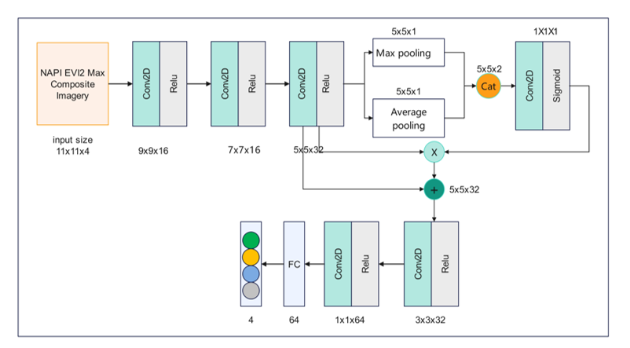

This is one record for project: Evaluating Building-Level Tree Cover Change in Southern California Wildland-urban Interface Using High-resolution Satellite Imagery
# Land Cover Mapping
+ We mapped 1 m land cover in Southern California WUI areas for years 2010 and 2022 using one attention-based CNNs model and NAIP Imagery. 

+ The model was trained on local machine and inferenced on  Google earth engine using matric operation.  
+ The mapping result is visible on the [web](https://ee-yl2022.projects.earthengine.app/view/wuilandcover). 